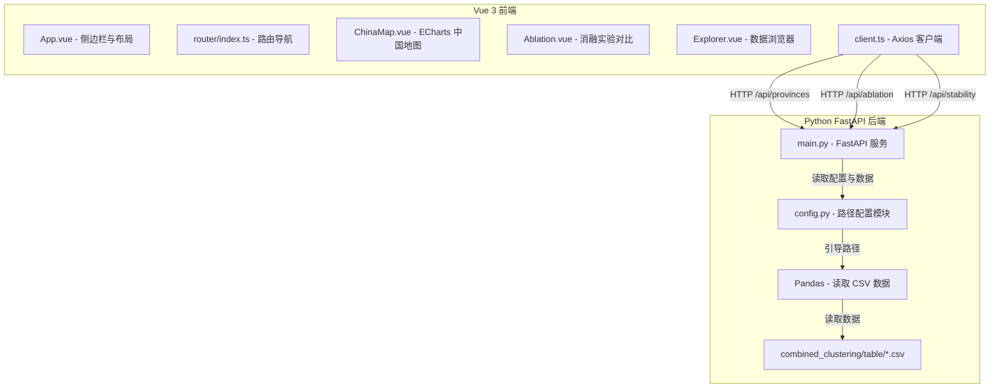

# 省级粮食预测聚类仪表盘系统设计规范

本项目旨在将原静态 HTML 分析报告 `combined_clustering/results_report.html` 重构为前后端分离的现代化交互式分析系统。系统采用 **Python FastAPI** 作为后端服务读取聚类数据，采用 **Vue 3 + TypeScript + Vite + ECharts** 作为前端架构实现动态仪表盘。

---

## 1. 系统架构与技术栈

本系统采用经典的前后端分离架构：



### 技术栈选型
- **前端 (Frontend)**: Vue 3 (Composition API / `<script setup>`), TypeScript, Vite, Vue Router, ECharts (与 `vue-echarts`), Axios.
- **后端 (Backend)**: Python 3.10+, FastAPI, Uvicorn, Pandas, Pydantic.
- **数据源**: 位于 `Province_Clusting/combined_clustering/table/` 目录下的 CSV 文件。

---

## 2. 后端 API 设计

后端 API 服务位于新建的 `backend/` 目录下，读取已生成的聚类数据 CSV 并输出标准 JSON。

### 2.1 目录结构与路径管理

```text
backend/
├── app/
│   ├── __init__.py
│   ├── config.py       # 常量及全局路径配置
│   ├── main.py         # 核心启动及路由逻辑
│   └── schemas.py      # Pydantic 响应模型
├── requirements.txt    # 依赖声明 (fastapi, uvicorn, pandas)
└── run.py              # 快速运行脚本
```

在 `config.py` 中，统一定义绝对路径，以防止后端运行时的相对路径加载错误：
```python
from pathlib import Path

# 项目根目录：/media/sf_Provincial_Grain_Forecast
PROJECT_ROOT = Path(__file__).resolve().parents[2]

# 数据源路径
CLUSTERING_DIR = PROJECT_ROOT / "Province_Clusting" / "combined_clustering"
TABLE_DIR = CLUSTERING_DIR / "table"

# 统一使用的 GeoJSON 地图数据路径
GEOJSON_PATH = PROJECT_ROOT / "Province_Clusting" / "common" / "china_provinces_online.json"
```

### 2.2 核心接口 (Endpoints)

#### 1. 获取所有省份聚类及基础数据
- **路径**: `GET /api/provinces`
- **数据源**:
  - `table/省份联合聚类结果.csv`（基础特征与主实验 M0 结果）
  - `table/六组实验省份聚类标签宽表.csv`（用于提取其它实验标签）
  - `table/省份分组稳定性.csv`（用于提取稳定性得分）
- **字段要求**:
  - 为确保地图匹配准确，后端统一输出行政区划代码 `adcode` 作为**唯一主键**（统一转换为 6 位字符串格式，如 `"110000"`）。
  - 响应包含主分类标签 `cluster_m0`、省份稳定性次数 `stability` 以及各维度（人口、经济、口粮、饲料粮）的核心最新年指标值。
- **响应示例**:
  ```json
  [
    {
      "name": "北京",
      "code": "110000",
      "cluster_m0": 1,
      "cluster_label": "高密度-高收入-口粮低位下降-饲料粮中位上升",
      "stability": 6,
      "metrics": {
        "pop_density": 1330.24,
        "disposable_income": 85415.0,
        "food_grain": 86.3,
        "feed_grain": 123.45
      },
      "labels": {
        "M0": 1,
        "C1": 1,
        "C2": 1,
        "C3": 1,
        "C4": 1,
        "C5": 1
      }
    }
  ]
  ```

#### 2. 获取消融实验评估及对比指标
- **路径**: `GET /api/ablation`
- **数据源**: `table/六组实验聚类质量对比.csv` 与 `table/六组实验省份聚类标签宽表.csv`
- **响应示例**:
  ```json
  {
    "metrics": [
      {
        "id": "M0",
        "name": "四域等权主实验",
        "domains": "人口、经济、口粮、饲料粮",
        "silhouette": 0.272,
        "ch_score": 11.764,
        "ari": 1.0,
        "sizes": [6, 3, 11, 10, 1]
      }
    ],
    "provinces_labels": {
      "110000": {"M0": 1, "C1": 1, "C2": 1, "C3": 1, "C4": 1, "C5": 1}
    }
  }
  ```

#### 3. 获取省份分组稳定性数据
- **路径**: `GET /api/stability`
- **数据源**: `table/省份分组稳定性.csv`
- **响应示例**:
  ```json
  [
    {
      "name": "江苏",
      "code": "320000",
      "stability_score": 5,
      "detail": "仅在移除经济域(C3)时分类漂移"
    }
  ]
  ```

---

## 3. 前端界面与交互设计

前端位于新建的 `dashboard-vue/` 目录下，核心展示形式为**左侧边栏导航 + 右侧独立工作台**。

### 3.1 目录结构与 Vite 入口规范

符合 Vite 标准规范，入口文件 `index.html` 必须放置在 `dashboard-vue/` 项目根目录下：

```text
dashboard-vue/
├── index.html              # Vite 默认入口文件
├── vite.config.ts          # Vite 配置文件
├── package.json
├── public/                 # 静态资源直出目录
│   └── favicon.ico
└── src/
    ├── assets/
    │   └── main.css        # 全局深色系 CSS 变量及过渡样式
    ├── router/
    │   └── index.ts        # Vue Router 路由表配置
    ├── components/
    │   ├── ChinaMap.vue    # 基于 ECharts 封装的交互地图组件
    │   └── MetricCard.vue  # 数据展示卡片
    ├── views/
    │   ├── Overview.vue    # 看板概览 (地图 + 基础统计)
    │   ├── Profiles.vue    # 五大类别的综合画像
    │   ├── Ablation.vue    # 消融实验与稳定性分析
    │   └── Explorer.vue    # 原始明细数据浏览器
    ├── App.vue             # 主布局结构 (Sidebar + RouterView)
    └── main.ts
```

### 3.2 路由与页面映射 (`src/router/index.ts`)

定义以下 4 个核心路由视图：
- `/`：对应 `Overview.vue`（概览看板）
- `/profiles`：对应 `Profiles.vue`（五大画像）
- `/ablation`：对应 `Ablation.vue`（消融与稳定性）
- `/explorer`：对应 `Explorer.vue`（明细数据浏览器）

### 3.3 地图匹配与着色规则

项目所用 GeoJSON 地图数据直接引用 `Province_Clusting/common/china_provinces_online.json`。为确保地图着色不受省份中文名称简写（如“北京” vs “北京市”）的影响：
1. **主键匹配**：前端 `ChinaMap.vue` 载入地图 GeoJSON 后，在 ECharts 绑定中以 `properties.adcode` 作为**唯一主键**与后端接口返回的 `code` (行政区划代码) 进行一一对应绑定。
2. **海南省代码校正**：强制应用 `460000` 作为海南省行政代码（避免部分历史地图数据错误使用 `450000` 或其他临时编码）。
3. **数据过滤与置灰**：
   - 港澳台地区以及其他在后端数据源中没有聚类结果的行政区，统一在 ECharts 的配置中通过 `visualMap` 的 `outOfRange` 或 `itemStyle` 设置为深灰色/淡色。
   - 统计卡片中的“覆盖省级行政区数量”指标严格以 API 传回的 31 个省为准，不计入上述未建模区域。

---

## 4. 开发与代理配置 (vite.config.ts)

为了在开发期间防止跨域问题，Vite 将配置反向代理指向本地运行的 FastAPI：

```typescript
import { defineConfig } from 'vite'
import vue from '@vitejs/plugin-vue'
import path from 'path'

export default defineConfig({
  plugins: [vue()],
  resolve: {
    alias: {
      '@': path.resolve(__dirname, './src'),
    },
  },
  server: {
    port: 5173,
    proxy: {
      '/api': {
        target: 'http://127.0.0.1:8000',
        changeOrigin: true,
      },
    },
  },
})
```

---

## 5. 错误处理与容错机制
- **数据加载错误处理**：前端 `Axios` 在捕获到网络请求失败（如后端服务未开启）时，需优雅地抛出提示气泡，并在地图与表格区域渲染 `Skeleton` 骨架占位图，避免白屏或脚本死锁。
- **缺失数据填补**：当某个省份在数据源中丢失时，地图上相应位置以灰色标示，并在表格中排除，保证系统不会因个别异常行崩塌。

---

## 6. 测试与验收标准

在系统部署前，应满足以下验收条件：

### 6.1 后端 API 测试验收
- `GET /api/provinces` 响应中必须严格返回 31 条省级行政区的数据，无缺失、无 NaN 字段，且 `code` 为 6 位字符串格式。
- `GET /api/ablation` 响应必须成功返回 M0 实验以及 C1-C5 实验的全部对比指标，Ari 一致性分数必须精确。
- `GET /api/stability` 响应应包含 31 条数据，各省稳定性分值必须为 1 到 6 之间的整数。

### 6.2 前后端集成与渲染验收
- **前端构建测试**：运行 `npm run build` 无任何 TypeScript 编译错误且打包成功。
- **地图渲染匹配**：31 个被分析省份应能根据各自对应的 `adcode` 正确渲染出 KMeans 聚类主色调；港澳台及南海诸岛等未参与聚类区域必须正确显示为置灰状态，并且不能参与 31 省的统计计数。
- **界面交互流畅度**：
  - 在消融实验页面中切换不同方案时，中国地图省份颜色过渡、卡片内容刷新应在 300ms 内完成，无可见卡顿。
  - 数据明细页面中的模糊检索和下拉筛选，应对输入响应做到即时过滤展示。
